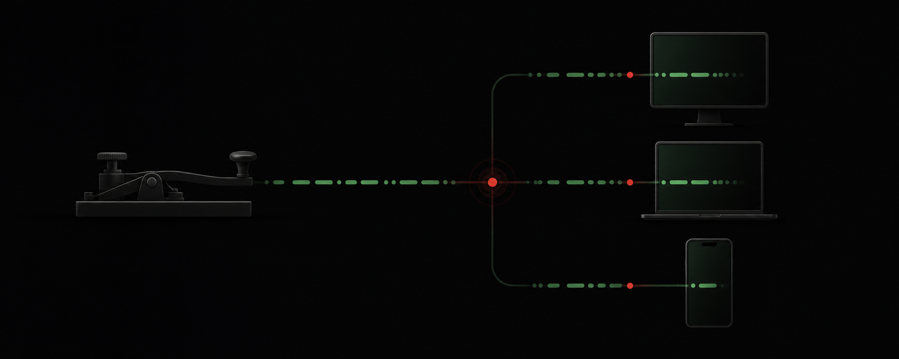

# Morse-vBand-LAN

[](https://nodejs.org/)
[](https://socket.io/)
[](https://docs.docker.com/compose/)



Contenedor Docker ideado para prácticas de telegrafía CW con varios operadores. Funciona dentro de una red LAN y no necesita conexión a Internet durante su ejecución.

Cada navegador convierte las entradas del manipulador en eventos CW. El servidor coordina los canales, controla el transmisor y distribuye los eventos mediante Socket.IO. El audio se genera localmente con WebAudio; no se transmite ni se graba audio.

Compatible con el dispositivo [Morse-vBand](https://github.com/frrojas92/Morse-vBand):

- `Ctrl izquierdo`: DIT
- `Ctrl derecho`: DAH
- También se puede usar un teclado convencional para pruebas.

## Características

- Directorio de canales activo para estudiantes e instructores.
- Canales independientes con control de transmisión semidúplex.
- Modos Iámbico A, Iámbico B y llave vertical.
- Velocidad, frecuencia, forma de onda y modo configurables por el instructor.
- Oscilador WebAudio persistente con temporización remota y protección frente a variaciones de Wi-Fi.
- Decodificación independiente de código Morse por operador.
- Paneles de decodificación amplios, multilínea y desplazables para mensajes largos.
- Limpieza visual independiente por operador sin eliminar el historial registrado.
- Activación o desactivación individual del decodificador de cada estudiante.
- Presencia del instructor, identificado por su indicativo, en las listas de usuarios.
- Monitorización de audio CW en vivo desde el panel del instructor.
- Transmisión Morse del instructor en un canal seleccionado con los mismos controles DIT/DAH, modos, decodificación y registros que una estación estudiantil.
- Tema oscuro completamente negro y tema claro seleccionable, con preferencia persistente en ambos portales.
- Emblema de la Escuela de Telecomunicaciones del Ejército de Chile en la esquina superior derecha de las vistas de estudiante e instructor.
- Ejercicios enviados desde el panel del instructor.
- Reserva del transmisor, modo solo recepción, silencio y desconexión de operadores.
- Registros descargables por canal u operador: transcripción TXT legible y detalle CSV por evento.

Los registros conservan fecha y hora, canal, dirección TX/RX, indicativo, código Morse, texto decodificado, PPM, modo del manipulador, frecuencia, forma de onda y duración de la pulsación. El TXT agrupa las letras en mensajes y reconstruye los espacios entre palabras; el CSV conserva una fila por carácter para análisis detallado.

## Decodificador y registros

Cada operador dispone de un panel independiente con el texto decodificado y el código Morse. Los paneles admiten varias líneas y añaden desplazamiento vertical cuando el contenido supera el espacio visible.

El botón **Limpiar vista** borra únicamente el contenido mostrado para ese operador en el navegador donde se pulsa. No modifica la vista de otros usuarios, el estado del servidor ni los registros descargables. Los caracteres recibidos después de limpiar aparecen como un mensaje nuevo.

Las descargas están disponibles tanto para el canal completo como para cada operador:

- **TXT:** transcripción detallada agrupada por operador y transmisión, seguida por una interacción compacta con dirección TX/RX, indicativo y texto.
- **CSV:** datos detallados por carácter, adecuados para hojas de cálculo y análisis.

## Inicio rápido con Docker

Requisitos:

- Docker Engine
- Complemento Docker Compose

```sh
git clone https://github.com/frrojas92/Morse-vBand-LAN.git
cd Morse-vBand-LAN
cp .env.example .env
docker compose up -d --build
```

Direcciones:

- Estudiante: `http://IP-DEL-SERVIDOR:8080`
- Instructor: `http://IP-DEL-SERVIDOR:8080/instructor.html`
- Estado del servidor: `http://IP-DEL-SERVIDOR:8080/health`

Si el usuario actual no tiene acceso al socket de Docker, ejecute los comandos con `sudo`.

Para reconstruir completamente después de actualizar el código:

```sh
docker compose build --no-cache
docker compose up -d --force-recreate
```

Después de reconstruir, actualice el navegador con `Ctrl+Shift+R` para evitar usar los archivos JavaScript o CSS almacenados en caché.

### Administración del contenedor

```sh
# Ver estado
docker compose ps

# Ver registros
docker compose logs -f

# Detener la aplicación
docker compose down
```

## Configuración del instructor

Defina `INSTRUCTOR_PIN` en `.env`:

```env
INSTRUCTOR_PIN=cambie-este-pin
```

Si no se configura, el valor de desarrollo es `morse-admin`. No utilice ese valor en una red compartida.

El instructor introduce su indicativo al iniciar sesión. Ese indicativo aparece en los canales activos para que los estudiantes puedan reconocerlo.

Al pulsar **Ingresar**, el navegador también habilita WebAudio. El instructor recibe y escucha las señales CW de los canales activos con la frecuencia y forma de onda configuradas para cada canal, al mismo tiempo que observa su decodificación en pantalla.

## Ejecución sin Docker

Requiere Node.js 20 o superior:

```sh
npm install
npm start
```

Abra `http://localhost:8080`.

Para ejecutar las pruebas:

```sh
npm test
```

## Arquitectura

```text
Navegador del operador
  ├─ public/cw-keyer.js   Temporización del manipulador
  ├─ public/cw-audio.js   Generación y programación del audio
  ├─ public/log-format.js Transcripción legible de los registros TXT
  └─ public/app.js        Interfaz y eventos del estudiante
             │
             │ Socket.IO: estados de tecla, salas y políticas
             ▼
Servidor Node.js
  ├─ server/server.js     HTTP, Socket.IO y acciones del instructor
  ├─ server/channels.js   Canales, transmisión, decodificación y registros
  └─ server/clients.js    Identidad temporal de los operadores
```

El panel del instructor utiliza `public/instructor.html` y `public/instructor.js`.

## Persistencia y seguridad

- Los canales, operadores, políticas, texto decodificado y registros se mantienen en memoria.
- Toda la información se pierde al reiniciar el servidor o eliminar el canal correspondiente.
- La autenticación del instructor protege únicamente las acciones administrativas.
- La aplicación está diseñada para una LAN de confianza y no debe exponerse directamente a Internet.
- Solo se transmiten eventos y estados; el audio permanece en cada dispositivo.

## Resolución de problemas

### La reconstrucción muestra una versión anterior

Compruebe que está ejecutando Docker Compose desde el clon correcto:

```sh
git rev-parse --short HEAD
pwd
docker compose up -d --build --force-recreate
```

Después, realice una actualización forzada del navegador.

### No se escucha audio en un teléfono

- Pulse **Ingresar** para permitir que el navegador active WebAudio.
- Mantenga la pantalla activa durante la práctica.
- Desactive temporalmente el ahorro de energía del navegador.
- Compruebe que el teléfono y el servidor estén en la misma red local.

### El instructor ve el código pero no escucha el audio

- Ingrese al panel mediante el botón **Ingresar** para que el navegador permita iniciar WebAudio.
- Compruebe que la pestaña y el sitio no estén silenciados.
- Recargue la página e ingrese nuevamente si el dispositivo de audio cambió durante la sesión.
- Reconstruya el contenedor y use `Ctrl+Shift+R` si el navegador aún conserva una versión anterior.

### No se puede acceder a Docker

Si aparece un error de permisos para `/var/run/docker.sock`, utilice `sudo docker compose ...` o configure el usuario en el grupo de Docker según las políticas del sistema.
